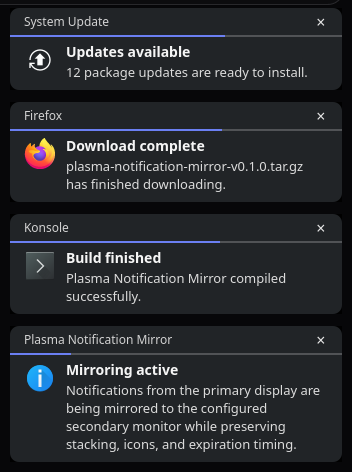

# Plasma Notification Mirror

[](https://github.com/MysteriousAeon/plasma-notification-mirror/actions/workflows/build.yml)

A small Wayland utility for KDE Plasma that mirrors desktop notification popups to one or more monitors.

Plasma normally shows a notification popup on only one monitor. Plasma Notification Mirror monitors accepted Freedesktop notification requests on the session D-Bus and draws lightweight, non-focus-stealing copies using KDE's `layer-shell-qt`.



*Mirrored KDE Plasma notifications on a secondary monitor.*

## Features

- Zero-configuration two-monitor default: mirrors to the first non-primary monitor
- Optional multi-monitor modes
- Configurable popup corner:
  - top-left
  - top-right
  - bottom-left
  - bottom-right
- Independent margins for all four screen edges
- Unrestricted margin offsets for large and high-resolution displays
- Configurable popup background opacity
- Per-monitor notification stacking
- Dynamic popup height
- KDE-like compact layout and expiration bar
- Transparent rounded corners
- Countdown pauses while the pointer is over a popup
- Manual close button
- Existing notifications compact when one is dismissed
- Application icon support via `app_icon`, `image-path` / `image_path`, and `desktop-entry` fallbacks
- Typed D-Bus monitoring: notifications are mirrored only after the notification daemon accepts them and returns their notification ID
- Handles notification replacement and `NotificationClosed` events
- Configurable width, lifetime, stack gap, and maximum popup count
- User-level systemd service
- No root process required

## Requirements

- KDE Plasma on Wayland
- Qt 6
- `layer-shell-qt`
- CMake
- `libsystemd` / sd-bus
- `pkgconf`

### Arch Linux / CachyOS

```bash
sudo pacman -S --needed cmake qt6-base layer-shell-qt systemd-libs pkgconf
```

## Build

```bash
git clone https://github.com/MysteriousAeon/plasma-notification-mirror.git
cd plasma-notification-mirror

cmake -S . -B build -DCMAKE_BUILD_TYPE=Release
cmake --build build -j$(nproc)
```

## Install for the current user

Install the binary, example configuration, and systemd user service under `~/.local`:

```bash
cmake --install build --prefix "$HOME/.local"

systemctl --user daemon-reload
systemctl --user enable --now plasma-notification-mirror.service
```

No configuration file is required.

With two monitors, the first non-primary monitor is selected automatically and notifications appear in the bottom-right corner using the built-in defaults.

### Manual installation

If you prefer to install the files manually:

```bash
mkdir -p ~/.local/bin ~/.config/systemd/user

cp build/plasma-notification-mirror \
  ~/.local/bin/plasma-notification-mirror

cp systemd/plasma-notification-mirror.service \
  ~/.config/systemd/user/

systemctl --user daemon-reload
systemctl --user enable --now plasma-notification-mirror.service
```

## Configuration

The optional configuration file is:

```text
~/.config/plasma-notification-mirror/config.ini
```

To start from the included example:

```bash
mkdir -p ~/.config/plasma-notification-mirror

cp config/config.example.ini \
  ~/.config/plasma-notification-mirror/config.ini

systemctl --user restart plasma-notification-mirror.service
```

### Monitor modes

```ini
[General]
mode=secondary
```

Available values:

- `secondary` — first non-primary monitor; default and zero-configuration behavior
- `all-secondary` — every non-primary monitor
- `screens` — only the monitors listed in `screens=`
- `primary` — primary monitor only
- `all` — every monitor

Example for selected monitors:

```ini
[General]
mode=screens
screens=DP-2,DP-3
```

Monitor names can be viewed with:

```bash
kscreen-doctor -o
```

### Popup position

```ini
[General]
position=bottom-right
```

Available values:

- `top-left`
- `top-right`
- `bottom-left`
- `bottom-right` — default

Notifications stack away from the selected corner. For example, notifications positioned at the top of the screen stack downward, while notifications positioned at the bottom stack upward.

### Margins

Each screen edge has its own margin:

```ini
[General]
left_margin=18
right_margin=18
top_margin=18
bottom_margin=58
```

Only the two margins relevant to the selected corner are used.

For example:

```ini
[General]
position=top-right
right_margin=24
top_margin=32
```

Margin values are not artificially capped, so large offsets can be used on high-resolution or unusual monitor layouts.

### Background opacity

```ini
[General]
background_opacity=100
```

`background_opacity` accepts values from `0` to `100`:

- `100` — fully opaque; default
- `0` — fully transparent

Values between them produce a translucent popup background. Rounded areas outside the notification card remain transparent.

### Other settings

```ini
[General]
lifetime_ms=5000
width=332
max_notifications=5
gap=12
```

Defaults:

- `lifetime_ms=5000` — popup lifetime in milliseconds
- `width=332` — popup width in pixels
- `max_notifications=5` — maximum simultaneous mirrored notifications per target monitor
- `gap=12` — space between stacked notifications in pixels

### Full configuration example

```ini
[General]

mode=secondary
screens=

position=bottom-right

lifetime_ms=5000
width=332
max_notifications=5
background_opacity=100

left_margin=18
right_margin=18
top_margin=18
bottom_margin=58

gap=12
```

## Testing

Send a test notification:

```bash
notify-send -i dialog-information \
  "Mirror test" \
  "This should appear on the configured mirror monitor."
```

Send several notifications to test stacking:

```bash
notify-send -a "Mirror Test" -i dialog-information "Notification 1" "First item"
notify-send -a "Mirror Test" -i dialog-information "Notification 2" "Second item"
notify-send -a "Mirror Test" -i dialog-information "Notification 3" "Third item"
```

Check the service:

```bash
systemctl --user status plasma-notification-mirror.service
```

Recent logs can be viewed with:

```bash
journalctl --user \
  -u plasma-notification-mirror.service \
  --no-pager \
  -n 100
```

## Updating

Pull and rebuild:

```bash
git pull

cmake -S . -B build -DCMAKE_BUILD_TYPE=Release
cmake --build build -j$(nproc)
```

If installed with `cmake --install`:

```bash
cmake --install build --prefix "$HOME/.local"
systemctl --user daemon-reload
systemctl --user restart plasma-notification-mirror.service
```

If you installed the binary manually, replacing a currently executing executable directly can produce `Text file busy`.

Use an atomic replacement instead:

```bash
cp build/plasma-notification-mirror \
  ~/.local/bin/plasma-notification-mirror.new

chmod +x ~/.local/bin/plasma-notification-mirror.new

mv -f \
  ~/.local/bin/plasma-notification-mirror.new \
  ~/.local/bin/plasma-notification-mirror

systemctl --user restart plasma-notification-mirror.service
```

## Uninstall

If installed under `~/.local` with CMake:

```bash
systemctl --user disable --now plasma-notification-mirror.service

rm -f ~/.local/bin/plasma-notification-mirror
rm -f ~/.local/share/systemd/user/plasma-notification-mirror.service
rm -rf ~/.local/share/plasma-notification-mirror

systemctl --user daemon-reload
```

For a manual installation:

```bash
systemctl --user disable --now plasma-notification-mirror.service

rm -f ~/.config/systemd/user/plasma-notification-mirror.service
rm -f ~/.local/bin/plasma-notification-mirror

systemctl --user daemon-reload
```

The optional user configuration can also be removed:

```bash
rm -rf ~/.config/plasma-notification-mirror
```

## Notes

Plasma Notification Mirror is intentionally a notification **mirror**, not a replacement notification daemon.

It does not attempt to duplicate:

- notification action buttons
- Plasma's notification history
- every internal Plasma notification UI behavior

It does track daemon-side notification replacement and close events so mirrored popups remain aligned with the notification service.

Some applications provide icons differently. The program currently tries:

- the standard `app_icon` field
- `image-path`
- `image_path`
- `desktop-entry`
- icon-theme fallbacks

Raw `image-data` pixel payloads are not decoded yet.

## License

MIT
